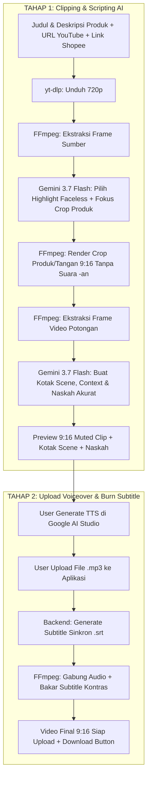

# 🎬 Local AI Affiliate Clipper

A local web application built with **React (Vite)** and **Node.js (Express)** that automates transforming YouTube videos into viral, high-converting **9:16 vertical reels** for **Shopee Affiliate Marketing**.

Powered by **Aivene gemini-3.7-flash** (30-60s faceless visual highlight clipping, product-aware crop focus, and Ad Advisor scripting), **yt-dlp**, and **FFmpeg** anti-detection rendering with voiceover upload and bottom-safe synchronized subtitle burning.

---

## 🌟 2-Stage Workflow Overview



---

## 🎯 5 Output Tab Kreatif Siap Pakai

1. **🎬 Kotak Scene**: Rincian per adegan (`timeRange`, deskripsi visual adegan, teks narasi spoken line, dan catatan sutradara *Ad Advisor* seperti SFX & text-on-screen).
2. **📋 Sample Context**: Rangkuman nama produk, target audiens, masalah utama yang diselesaikan (*pain points*), keunggulan utama (USPs), dan trigger psikologis pembelian.
3. **🎙️ Naskah Voiceover (ID)**: Format standar *Ad Advisor* (`[HOOK 0-3s]` → `[DEMO & BENEFIT 3-20s]` → `[VALUE PROPOSITION 20-35s]` → `[CALL TO ACTION 35-60s]`) berbasis judul & deskripsi produk spesifik.
4. **🤖 Prompt Google AI Studio**: Prompt terstruktur siap copy-paste langsung ke Google AI Studio untuk generate TTS audio.
5. **📱 Reels Caption & Shopee Link**: Caption siap posting lengkap dengan emoji, hashtag viral (#racunshopee, #spillracun, dll.), dan link Shopee Affiliate Anda.

---

## 🚀 Cara Menjalankan Aplikasi Secara Lokal

### 1. Buka Terminal di Folder Proyek
```powershell
cd "c:\Users\SEMOGA AWET\Documents\Clippers"
```

### 2. Jalankan Server & Client Bersamaan
```powershell
npm run dev
```

> **Alamat Layanan:**
> - **Frontend (React/Vite)**: `http://localhost:3000`
> - **Backend (Express API)**: `http://localhost:5000`

---

## 📱 Panduan Penggunaan 2-Tahap

1. **Tahap 1 (Clipping & Scripting)**:
   - Pastikan `AIVENE_API_KEY` sudah terisi di file `server/.env`.
   - Masukkan **Judul / Nama Produk** (Contoh: *Mini Portable Blender USB 350ml Rechargeable*).
   - Masukkan **Deskripsi & Spesifikasi Produk** (Poin penting & keunggulan barang).
   - Masukkan **YouTube Video URL** dan **Shopee Affiliate Link**.
   - Klik **"Generate Kotak Scene & Video 9:16"**.
   - **Gemini 3.7 Flash** memotong segmen 30-60 detik yang faceless, memilih fokus crop produk/tangan, dan menghindari teks bawaan video.
   - **FFmpeg** merender video 9:16 penuh tanpa suara (`-an`) tanpa bar hitam besar, dengan crop area atas untuk menghindari wajah creator.
   - **Gemini 3.7 Flash** membuat Kotak Scene, Sample Context, dan Naskah Voiceover yang akurat sesuai detail produk Anda.
2. **Tahap 2 (Upload Voiceover & Finalisasi)**:
   - Buka tab **Prompt Google AI Studio** atau **Naskah Voiceover** dan copy teksnya.
   - Generate audio TTS di [Google AI Studio](https://aistudio.google.com) lalu download file `.mp3`.
   - Drag & drop file `.mp3` ke kotak **Tahap 2: Upload Voiceover AI Studio**.
   - Klik **"Gabungkan Voiceover & Bakar Subtitle (Final Video)"**.
   - Preview video final dengan subtitle dan klik **Download Video .mp4 (Final with Subtitles)**.
