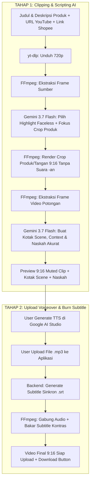

# 🎬 Local AI Affiliate Clipper

A local web application built with **React (Vite)** and **Node.js (Express)** that automates transforming YouTube videos into viral, high-converting **9:16 vertical reels** for **Shopee Affiliate Marketing**.

Powered by **Aivene gemini-3.7-flash** (30-60s faceless visual highlight clipping, product-aware crop focus, and Ad Advisor scripting), **yt-dlp**, and **FFmpeg** anti-detection rendering with voiceover upload and bottom-safe synchronized subtitle burning.

---

## 🌟 2-Stage Workflow Overview



---

## 🎯 5 Output Tab Kreatif Siap Pakai

1. **🎬 Kotak Scene**: Rincian per adegan (`timeRange`, deskripsi visual adegan, teks narasi spoken line, dan catatan sutradara *Ad Advisor* seperti SFX & text-on-screen).
2. **📋 Sample Context**: Rangkuman nama produk, target audiens, masalah utama yang diselesaikan (*pain points*), keunggulan utama (USPs), dan trigger psikologis pembelian.
3. **🎙️ Naskah Voiceover (ID)**: Format standar *Ad Advisor* (`[HOOK 0-3s]` → `[DEMO & BENEFIT 3-20s]` → `[VALUE PROPOSITION 20-35s]` → `[CALL TO ACTION 35-60s]`) berbasis judul & deskripsi produk spesifik.
4. **🤖 Prompt Google AI Studio**: Prompt terstruktur siap copy-paste langsung ke Google AI Studio untuk generate TTS audio.
5. **📱 Reels Caption & Shopee Link**: Caption siap posting lengkap dengan emoji, hashtag viral (#racunshopee, #spillracun, dll.), dan link Shopee Affiliate Anda.

---

## 🚀 Cara Menjalankan Aplikasi Secara Lokal

### 1. Buka Terminal di Folder Proyek
```powershell
cd "c:\Users\SEMOGA AWET\Documents\Clippers"
```

### 2. Jalankan Server & Client Bersamaan
```powershell
npm run dev
```

> **Alamat Layanan:**
> - **Frontend (React/Vite)**: `http://localhost:3000`
> - **Backend (Express API)**: `http://localhost:5000`

---

## 📱 Panduan Penggunaan 2-Tahap

1. **Tahap 1 (Clipping & Scripting)**:
   - Pastikan `AIVENE_API_KEY` sudah terisi di file `server/.env`.
   - Masukkan **Judul / Nama Produk** (Contoh: *Mini Portable Blender USB 350ml Rechargeable*).
   - Masukkan **Deskripsi & Spesifikasi Produk** (Poin penting & keunggulan barang).
   - Masukkan **YouTube Video URL** dan **Shopee Affiliate Link**.
   - Klik **"Generate Kotak Scene & Video 9:16"**.
   - **Gemini 3.7 Flash** memotong segmen 30-60 detik yang faceless, memilih fokus crop produk/tangan, dan menghindari teks bawaan video.
   - **FFmpeg** merender video 9:16 penuh tanpa suara (`-an`) tanpa bar hitam besar, dengan crop area atas untuk menghindari wajah creator.
   - **Gemini 3.7 Flash** membuat Kotak Scene, Sample Context, dan Naskah Voiceover yang akurat sesuai detail produk Anda.
2. **Tahap 2 (Upload Voiceover & Finalisasi)**:
   - Buka tab **Prompt Google AI Studio** atau **Naskah Voiceover** dan copy teksnya.
   - Generate audio TTS di [Google AI Studio](https://aistudio.google.com) lalu download file `.mp3`.
   - Drag & drop file `.mp3` ke kotak **Tahap 2: Upload Voiceover AI Studio**.
   - Klik **"Gabungkan Voiceover & Bakar Subtitle (Final Video)"**.
   - Preview video final dengan subtitle dan klik **Download Video .mp4 (Final with Subtitles)**.

---

---

## ☁️ Panduan Lengkap: Menjalankan di GitHub Codespaces / Cloud Server

Menjalankan backend di cloud server (seperti GitHub Codespaces / Azure / AWS) memerlukan penanganan khusus karena YouTube secara aktif memblokir IP Datacenter. Berikut adalah prosedur resmi dan teruji agar pencarian dan pengunduhan video berjalan 100% lancar:

```
                  ┌─────────────────────────────────────────────────────────┐
                  │                 GITHUB CODESPACES                       │
                  │                                                         │
   [Search Video] ├─► RapidAPI (yt-api.p.rapidapi.com) ───────────────────► │
                  │                                                         │
 [Download Video] ├─► yt-dlp + Node JS Runtime + EJS Solver                 │
                  │        │                                                │
                  │        ▼                                                │
                  │   Cloudflare WARP (socks5://127.0.0.1:40000)            │
                  │        │                                                │
                  │        ▼                                                │
                  │   YouTube Sesi Asli (via server/cookies.txt) ─────────► │
                  └─────────────────────────────────────────────────────────┘
```

---

### 1. Konfigurasi Environment (`server/.env`)

Buat file `server/.env` di Codespace dengan konfigurasi berikut:

```env
PORT=5000

# API Key untuk AI Scripting & Visual Analysis
AIVENE_API_KEY=your_aivene_api_key_here

# RapidAPI (Digunakan untuk Search Video tanpa limit IP Datacenter)
RAPIDAPI_KEY=your_rapidapi_key_here
RAPIDAPI_HOST=yt-api.p.rapidapi.com
```

> **Catatan:** Pencarian video menggunakan RapidAPI `yt-api.p.rapidapi.com` agar bebas dari blokir IP dan rate limit scraping YouTube.

---

### 2. Setup Cloudflare WARP (Bypass Blokir IP Datacenter)

IP bawaan Codespace (Azure Datacenter) langsung diblokir oleh Google. Kita menggunakan Cloudflare WARP untuk mendapatkan rute IP Anycast residensial:

```bash
# 1. Jalankan daemon WARP di background
sudo warp-svc &

# 2. Registrasi koneksi (cukup sekali saat setup awal Codespace)
warp-cli register

# 3. Hubungkan ke Cloudflare WARP
warp-cli connect

# 4. Verifikasi status koneksi (Pastikan muncul "Status update: Connected")
warp-cli status
```

> Backend secara otomatis mendeteksi Linux/Codespace dan mengarahkan lalu lintas `yt-dlp` ke proxy lokal `socks5://127.0.0.1:40000`.

---

### 3. Setup Autentikasi YouTube (`server/cookies.txt`)

Untuk mencegah error `Sign in to confirm you're not a bot`, `yt-dlp` membutuhkan cookie dari akun Google/YouTube yang aktif:

1. Buka browser Chrome / Edge di laptop Anda (pastikan sedang **login ke akun Google/YouTube**).
2. Pasang ekstensi Chrome: **[Get cookies.txt LOCALLY](https://chromewebstore.google.com/detail/get-cookiestxt-locally/cclelndahbckbenkjhflpdbgdldlbecc)** atau **Cookie-Editor**.
3. Buka tab [youtube.com](https://www.youtube.com/).
4. Klik ekstensi, pilih **Export** (Format: **Netscape**). File akan berisi ~50-200 baris cookie (`LOGIN_INFO`, `__Secure-1PSID`, `SID`, dll.).
5. Buat atau timpa file `server/cookies.txt` di Codespace dengan isi cookie tersebut:
   ```bash
   # Di Codespace:
   nano server/cookies.txt
   # (Paste seluruh cookie, lalu simpan dengan Ctrl+O, Enter, Ctrl+X)
   ```

---

### 4. Menjalankan Aplikasi

Setelah WARP aktif dan `cookies.txt` terpasang, jalankan dev server:

```bash
# Sinkronkan kode terbaru
git fetch origin main
git reset --hard origin/main

# Jalankan server
node dev-runner.js
```

---

### 🛡️ Parameter Kunci `yt-dlp` yang Digunakan Backend

Backend mengombinasikan 4 teknologi bypass otomatis:
- `--proxy socks5://127.0.0.1:40000` : Melewati jaringan Cloudflare WARP untuk masking IP.
- `--cookies server/cookies.txt` : Autentikasi sesi pengguna Google asli.
- `--js-runtimes node` : Menggunakan engine Node.js lokal untuk mengeksekusi challenge script YouTube.
- `--remote-components ejs:github` : Mengunduh solver enkripsi *n-challenge* terbaru langsung dari repository resmi GitHub secara otomatis.

